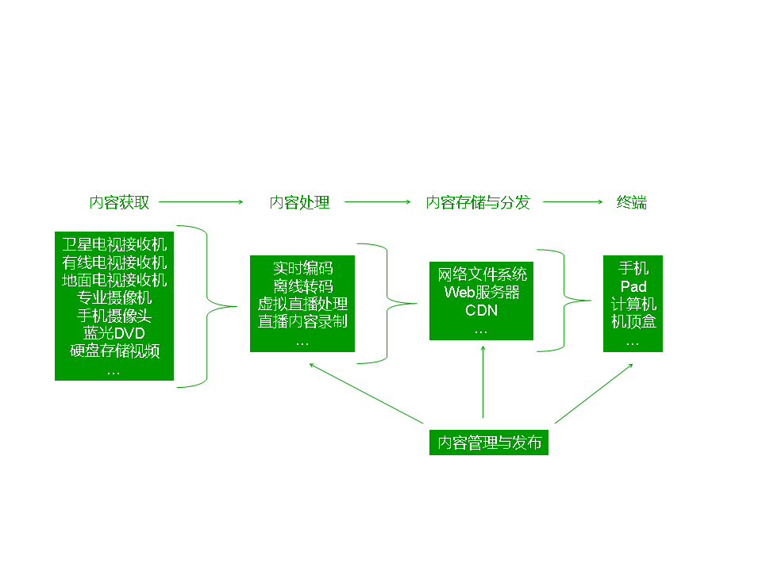

# 部署方案

## 概况

如图所示是视频内容从获取到播放的流程。内容获取通常采用专用设备，输出方式可以是IP，也有可能是其它方式，内容处理通常采用纯软件的方式，需在通用服务器上运行，内容存储与分发也是纯软件，需要在通用服务器上运行，终端方面，计算机通常采用浏览器的方式来访问，而pad、手机、机顶盒需要专用的应用。
多数单位已经部署了IP网络，因此部署方案假定网络已经部署完成，且满足OTT多屏方案的要求

